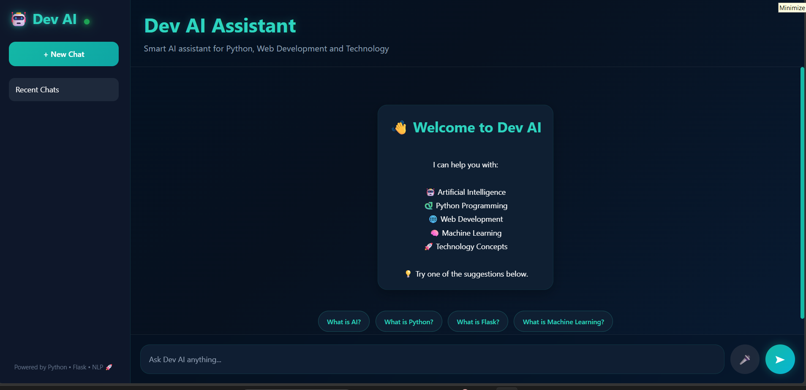
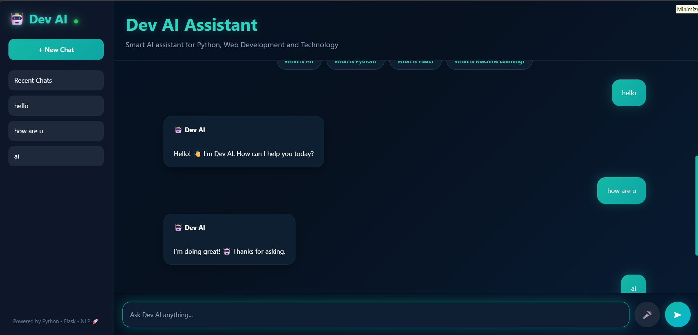

# 🤖 Dev AI - FAQ Chatbot

## About the Project

Hello everyone! 👋

This project was developed as part of my **CodeAlpha Internship Program**.

Dev AI is a FAQ-based chatbot that can answer questions related to Artificial Intelligence, Python Programming, Machine Learning, Web Development, and other technology topics. The chatbot uses Natural Language Processing (NLP) techniques to understand user queries and provide the most relevant response.

While working on this project, I focused on creating a clean user interface and improving the chatbot experience with features such as chat history, voice input, quick suggestions, and responsive design.

---

## Features

✨ Modern Dark Blue + Teal UI

✨ FAQ-Based Chatbot using NLP

✨ Voice Input Support

✨ Chat History Storage

✨ Quick Suggestion Buttons

✨ Responsive Design

✨ New Chat Functionality

✨ Online Status Indicator

✨ Fast and Lightweight Flask Backend

---

## Screenshots

### Home Screen



### Welcome Screen


### Chat Example



---

## Technologies Used

* Python
* Flask
* HTML
* CSS
* JavaScript
* Scikit-learn
* TF-IDF Vectorization
* Cosine Similarity

---

## How to Run the Project

### Clone the Repository

```bash
git clone https://github.com/nutunjkamdi54-crypto/CodeAlpha_FAQ_Chatbot.git
```

### Move to the Project Folder

```bash
cd CodeAlpha_FAQ_Chatbot
```

### Install Required Packages

```bash
pip install flask scikit-learn
```

### Run the Application

```bash
python app.py
```

### Open in Browser

```text
http://127.0.0.1:5000
```

---

## What I Learned

Working on this project helped me learn:

* Basics of Natural Language Processing (NLP)
* Flask Web Development
* Frontend Design using HTML, CSS, and JavaScript
* TF-IDF and Cosine Similarity
* Building Interactive User Interfaces
* Improving User Experience in Chat Applications

---

## Future Improvements

* Integration with Gemini API
* More FAQ Categories
* Database Support
* Better Chat Management
* Multi-language Support

---

## Author

**Nutunj Kamdi**

CodeAlpha Internship Project 🚀
